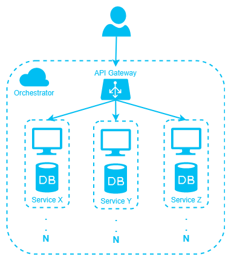

During my career I often worked as backend developer for multiple games and I have to say I liked it.

I find the whole thing really interesting: it offers nice challenges and forces you to learn a lot of concepts, in order to be effective.

For this reason I decided to describe my process with some articles on this blog, with this new series. It could be useful for readers who want to learn, but in the end it will surely be useful for me, in order to fix ideas and to collect feedback from other developers about my workflow.

So let's start.

### Composition of a backend architecture

When it comes to building something so massive from scratch, my first step is to identify requirements and constraints for the architecture that I am going to build for, as well as the functionalities needed for the game.

So let's proceed by identifying them.

##### Requirements and constraints

- __*Logging*__: storing a trace of what happens in the whole architecture: errors, warnings, unexpected situations, transactions, etc. Everything needed to understand what is going on in the whole system.
- __*Metrics*__: collecting metrics from the whole architecture: resources usage, load, responsiveness, average response times, error rate, etc. Everything needed to understand how the whole system is performing.
- __*Scalability*__: the architecture should manage any load without going down or degrading.
- __*Decoupling*__: all subsystems should be independent from each others. This ensures the maximum modularity and...
- __*Fault tolerance*__: the system should be able to recover from an error and/or from the failure of a subsystem without impacting other subsystems.

##### Functionalities

- __*Authentication*__: the players must be able to authenticate. Ideally this exposes an account system but also a way to authenticate with Facebook, Twitter, etc.
- __*Chat*__: all respectable multiplayer games have a chat!
- __*Matchmaking*__: group players together (1 or more), match groups together to compose matches.  

For each previously listed point I will write an article to discuss a possible implementation.

And now let's sketch out something that can fit with our plans!

### Sketching out the architecture

How to organize and expose all those functionalities? How to build a proper architecture that can support our needs?

I decided to follow the __*microservices architectural pattern*__. Basically the whole backend will be made of a collection of independent, loosely coupled, self-contained micro applications (micro services) that will deal with a specific part of the business logic.

This decision brings to the table some __*advantages*__:

- we can use different technologies for different services. This means you can pick the best tech for a specific task without affecting other services.
- smaller, independent applications are:
  - easier to develop
  - easier to test
  - easier to understand
- deployment is easier, it does not affect other services so you can push bugfixes easier

but also some __*disadvantages*__:

- debugging interservices operations could be hard
- services need a way to communicate with each others (this means an additional layer of complexity)
- the base resources requirement is higher (multiple instances, so multiple host runtimes, etc)

Another interesting thing to note is: we don't want to expose our subsystems to the outer world. Ideally we want to isolate them, so that clients cannot send requests directly. This is for two reasons:

- malicious users cannot try to exploit the internal API (generally, they should not be able to mess with it)
- the client doesn't need to know the address of each service we deploy

Also, it could be desiderable assuming that the internal API will only receive already validated and authorized requests, in this way we don't need to duplicate validation and authorization logic on every service.

For satisfying these needs the only service we publicly expose will be the __*API Gateway*__.

It just collects messages from users, validates them (checking they are well-formed, they contain something in particular, etc), authorizes them (checking they come from an authorized user). Neat.

After this step we know that the message is valid and we are ready to push it deeper in our architecture, by routing it to the correct service. Other services will process the data, store information if needed and report back the result.

> It is important to note that having an API Gateway to manage incoming messages has an additional hidden benefit: you can *decouple* the protocol you use to communicate among your internal architecture from the protocol your clients use to connect and send messages. Example: your clients could use __*Websocket*__ or __*HTTP*__ to establish the connection and to exchange data with the API Gateway, and your backend architecture can use __*TCP*__ or __*UDP*__ to communicate internally.

But don't forget about another constraint we want to satisfy: the __*scalability*__. The whole system has to work under any load. We can't say: *"hey, you can't connect, we are already managing 10,000 users. Come back in an hour or two"*. Not in my backend!

### Orchestrator

What if our services can't manage the load? Or our API Gateway goes down on its knees because of the traffic burst? I would need __*multiple*__ API Gateway on different servers. Generally speaking, I would need __*N*__ service instances, on different physical servers, that can perform the same tasks and share the load dynamically. And they have to act like a single one: if instance Y changes the state of my game, other instances have to be aware of this.

Now we have multiple instances of everything, but something is still missing. Something must manage all these instances, something must __*orchestrate*__ the whole architecture. Its role should be to keep track of which instances are currently spawned, their load, their details. Not only: it has to be able to spawn instances when needed or destroy them when there is no load.

You can write your own solution or you can simply use something already battle-tested like __*Kubernetes*__ or __*Docker Swarm*__.

The architecture at this point should look like this:

### Final notes

I usually work with __*.NET Core*__, so expect to see a lot of __*C#*__: for this project it will be my tech of choice.

Every service will be packaged in a __*Docker container*__.

I hope it was clear and straightforward.
In the next article I will start to implement the first service.
