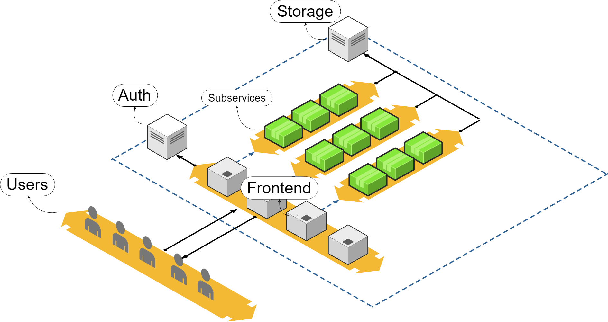
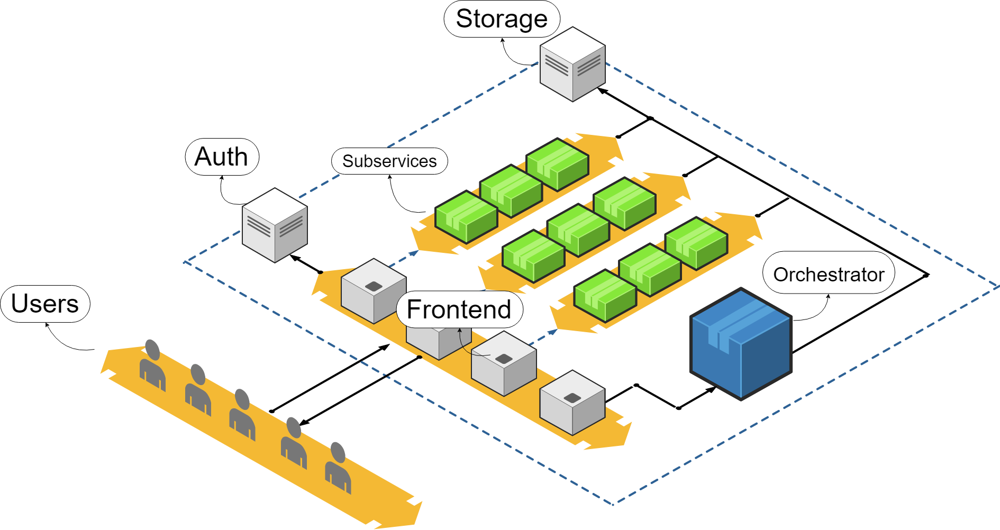

During my career I often worked as backend developer for multiple games and it is a pretty interesting matter. Recently I started to work on a game of mine with some other fellows, the game is named "__*Duke it out in the arena!*__": I will certainly write something about it later this year. However, for this game I am dealing with *(do you dare to guess?)* the backend architecture.

Because of the game's multiplayer nature, we will need common services like auth, chat, lobbies, matchmaking, storaging, etc.

I find the whole thing really interesting, for this reason I decided to describe my process with some articles on this blog, with this new series. It could be useful for readers who want to learn, but in the end it will surely be useful for me, in order to fix ideas and to collect feedback from other developers about my workflow.

### Composition of a backend architecture

My main approach when it comes to build a backend from scratches is to split functionalities in multiple, standalone services that can operate on their own, independently, with minimal dependencies among each others.

So let's proceed by identifying common functionalities I surely need (probably in every game's backend):

- I need a way to __*authenticate*__ an user
- users' requests need to be __*valid*__, so I need to craft a system to ensure all requests come from the authenticated user before any further processing
- I need a way to __*log*__ what happens in the whole architecture during runtime: errors, exceptions, debug data, etc. all in a convenient place like a dashboard
- I need a way to __*store*__ users' data, in a generic way. Every subservice can throw at it arbitrary data to store (and can retrieve it too) at any moment
- I need a way to __*describe a subservice*__ and its logic to compose the real behavior of my backend
- the whole thing must be __*scalable*__: it means the architecture has to be able to correctly manage any kind of load

The previous list represents the base functionalities of my architecture. Something I will reuse over all my backend projects.

But alone those functionalities do not make our architecture usable for a game. I need to add subservices in order to define the actual business logic of the whole thing. Let's see what I need:

- a __*chat*__ subservice. Every respectable multiplayer game has a chat!
- a __*lobby*__ subservice. Users can group together to join the game, basically
- a __*matchmaking*__ subservice. It manages the matches composition, matching together lobbies with some (currently undefined) criteria

For each previously listed point I will go to create an article to describe my implementation.

### Sketching out the architecture

Let's sketch out something that can fit with our plans! Currently we know users will send messages we have to process to alter the internal state of our game.
Before processing them, we want to be sure that the sender is authenticated and the message is well-formed (*validation*). A specialized subservice can deal with this validation step: I called it __*Frontend Service*__. It just collect messages from users and validates them. Neat.
After this step we know that the message is valid and we are ready to push it deeper in our architecture, by routing it to the correct subservice. Subservices will process the data, store information if needed and report back the result.

> It is important noting that having a frontend service to manage incoming messages has another hidden benefit: you can decouple the protocol you use to communicate in your architecture from the protocol your clients use to connect and send messages. Example: your clients could use Websocket to establish the connection and to exchange data with the Frontend Service, and your backend architecture can use HTTP and TCP/UDP to communicate internally.

But don't forget about another constraint we want to satisfy: the __*scalability*__. The whole system has to work under any load. We can't say: *"hey, you can't connect, we are already managing 10000 users. Come back in an hour or two"*. Not in my backend!

Of course I want to consider some scenarios: what if our subservices can't manage the load? Or our frontend service goes down on its knees because of the traffic burst? I need __*multiple*__ frontend services, generally I need __*N*__ subservices instances that can perform the same task and share the load dynamically. And they have to act like a single one: if instance Y changes the state of my game, other instances have to be aware of this.

It should look like this:

So now I have multiple instances of everything, but something is still missing. Something has to manage all these instances, something has to __*orchestrate*__ the whole architecture. That's why I add another specialized subservice: I named it __*Orchestrator Service*__. Its role is just to keep track of which instances are currently spawned, their load, their details. Not only: it has to be able to spawn instances when needed or destroy them when there is no load. Also, it offers an API to retrieve which service is available to be connected to.
Example: I am the player, I want to connect to a frontend service. I ping an endpoint to retrieve the available endpoint to connect to. Not only, this can be used internally by the subservices if they need to communicate with another one.

Here it is:

### Implementation

I will implement this architecture on __*.NET Core*__ with __*C#*__. I will push the project on GitHub as independent packages since it will be highly modular.
Probably I will also experiment with Azure this time: they have a nice tooling for backend development!

I hope it was clear and straightforward.
In the next article I will start to implement the first service: the Auth.
