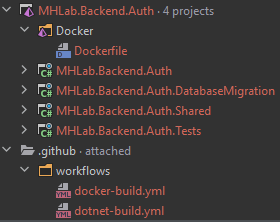
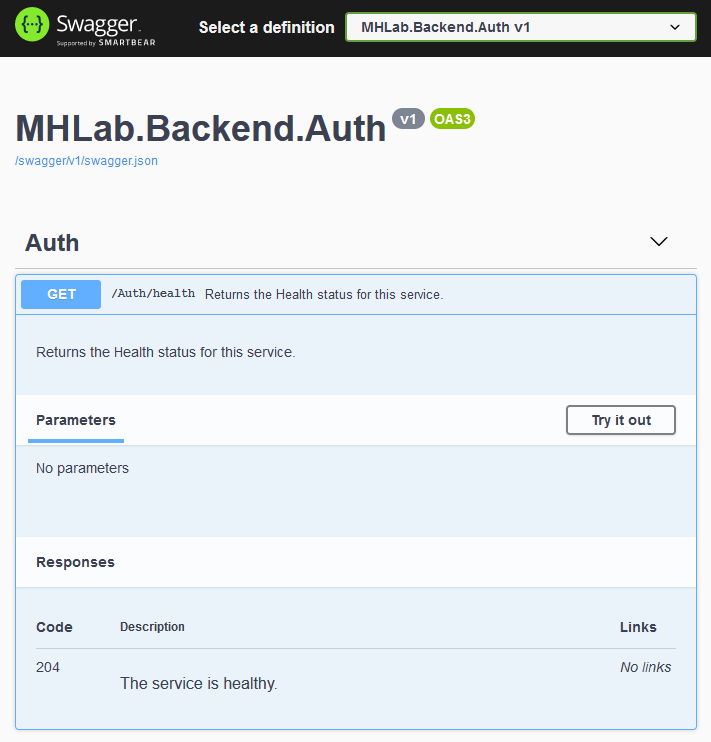

Let's talk about the first service: the Auth Service.

### The project structure

I can see you being so excited, but you need to wait a little bit more: I am starting a new project, so I first want to talk about how to organize it.

I'll code this service with __C#__, on __ASP.NET 5__. I create some C# projects:

- __*MHLab.Backend.Auth*__ project: it contains the logic for the service itself. It can be a simple console application or whatever. In this case it will be an ASP.NET Web API.
- __*MHLab.Backend.Auth.Shared*__ project: it contains the data, requests/responses and generally what could be useful for other services or clients.
- __*MHLab.Backend.Auth.Tests*__ project: it contains tests for the service's code.
- __*MHLab.Backend.Auth.DatabaseMigration*__ project: it contains the code to initialize the database, if needed.

I also added:

- a __*Dockerfile*__: used to build the Docker image for this service
- some __*GitHub Actions workflows*__: used to build and test the service on push

<center></center>

I've also created a different solution (`MHLab.Backend.Utilities`) to share some common code among all services I'll write on C#, to avoid wasting time and space by having huge code snippets.
Basically I've grouped some features like HTTP basic features, etc.

The above structure represents how I usually organize my services in C#.

### Planning the Auth Service

The main purpose of the Auth Service is allowing players to *(guess what)* authenticate their requests by confirming their identity. The authentication process is usually performed by sending an username and a password and obtaining back an auth token that can be used for other requests. This implies that I will need an __*Account Service*__ to handle accounts.

### Functionalities

- __*Register a new account*__: the player should be able to register a new account before being able to log in. This registration must be verified through email validation or social media (Facebook, Twitter, etc) login.
- __*Authenticate*__: the player should be able to get an auth token by providing username and password.
- __*Refresh the auth token*__: the player should be able to obtain a new auth token by proving the old one.

These are the main features for now, but they are not the only ones. But for now stick with me: we will add later additional ones if needed.

### Requirements and Constraints

Normally the Authorization process is useful for all the applications that can interact with the backend: the game, the website, the mobile app, the store, etc. For this reason a good way to implement this service is on top of __HTTP__, as a __REST API__.

Another important requirement is the documentation: the API surface should be easily usable by any other developer who wants to interact with it, so a documentation/reference is needed. [Swagger](https://swagger.io/) is a nice tool for this purpose and it comes with a useful integration for ASP.NET: [Swashbuckle](https://github.com/domaindrivendev/Swashbuckle.AspNetCore).

Also, remember that all services are [cloud-native](https://en.wikipedia.org/wiki/Cloud_native_computing) applications. This brings in some more requirements, in particular the fact it must horizontally scale. This means it needs to be stateless and multiple instances of this service could run concurrently in the architecture.

### Health check

The first endpoint in my Auth Service API (and in all other future services) will be the health checking. This comes in handy to understand if our deployed service is healthy and can process requests.

The first thing first: I create the integration test for this endpoint. It will help me ensuring correctness in my API *(I know this particular case is trivial, but it's perfect to show the workflow)*.

As test suite I am using [NUnit](https://nunit.org/), but every other one will do the trick. Also, I am using the [Microsoft.AspNetCore.TestHost](https://docs.microsoft.com/it-it/dotnet/architecture/microservices/multi-container-microservice-net-applications/test-aspnet-core-services-web-apps#implementing-integration-and-functional-tests-for-each-microservice) package: it allows me to spawn a web host suited for integration tests (it also removes the network calls overhead).

```csharp
namespace MHLab.Backend.Auth.Tests.Integrations
{
    public class HealthTests
    {
        private TestServer     _host;
        private IBackendClient _client;

        [SetUp]
        public void Setup()
        {
            _host = new TestServer(
                new WebHostBuilder()
                    .UseStartup<Startup>()
            );

            _client = new BackendClient(_host.CreateClient());
        }

        [TearDown]
        public void Teardown()
        {
            _host.Dispose();
            _client.Dispose();
        }

        [Test]
        public async Task Health_Success()
        {
            var result = await _client.GetHealth();

            Assert.True(result.IsSuccess);
        }
    }
}
```

As you can see, the code simply initializes the test server and a client that can communicate with the API.
Before I can even run this test, I need to extend the `IBackendClient` interface:

```csharp
namespace MHLab.Backend.Auth.Shared
{
    public static class AuthClient
    {
        public static async Task<Response> GetHealth(this IBackendClient client)
        {
            const string endpoint = "Auth/health";

            return await client.GetNoContentAsync(endpoint);
        }
    }
}
```

It's very simple and straightforward: it just sends a `GET` request against the Health endpoint and reports back the success/failure.

If you run the test right now, it will fail. That's normal: the Health endpoint does not exist yet.
Let's create it:

```csharp
namespace MHLab.Backend.Auth
{
    [Authorize]
    [ApiController]
    [Route("[controller]")]
    public class AuthController : ControllerBase
    {
        [AllowAnonymous]
        [HttpGet("health")]
        public async ValueTask<IActionResult> HealthCheck()
        {
            return NoContent();
        }
    }
}
```

If you run the `Health_Success` test now, finally it turns green: success! This means that our client is correctly requesting for service's health and the server is correctly responding back (with `204 No Content`).

Let's add some documentation to this endpoint:

```csharp
/// <summary>
/// Returns the Health status for this service.
/// </summary>
/// <response code="204">The service is healthy.</response>
[ProducesResponseType(StatusCodes.Status204NoContent)]
[AllowAnonymous]
[HttpGet("health")]
public async ValueTask<IActionResult> HealthCheck()
{
    return NoContent();
}
```

These annotations will decorate the auto-generated Swagger reference, as you can see:

<center></center>

### Authenticate

Now I think you got what my workflow is. Let's proceed with actual features then! The authentication feature is simple:

> The user must be able to obtain an `auth token` by providing valid login credentials.

Aaaaand it's time for some theory.

What's an `auth token`? I mentioned it very often in this article, but I didn't explain its meaning.

You certainly noticed the `[Authorize]` and `[AllowAnonymous]` attributes in the previous code snippets. Well, in few words, normally API endpoints are protected by some authorization logic. This prevents unwanted usage, enhances security, etc. A lot of good things.

The `[Authorize]` attribute ensures that all endpoints in that class will require an authorization mechanism in order to be called.
Of course, the Health endpoint could be called by unauthorized clients so I added the `[AllowAnonymous]` attribute.

You can test it: try to remove the `[AllowAnonymous]` attribute and run the test again. It will fail, because the request was unauthorized.

This is where the auth token kicks in: it is a simple string that can be added in the request's `Authorization` header and the server will be fine (if the token is valid).

As you can guess, the mechanism will be the following:

- the user provides credentials
- the server checks if these credentials are valid
- if they are, the server responds back with an auth token
- the client stores the token and uses it for its next requests

As simple as that.

##### The Auth Token: JWT

The auth token could be whatever you want, you can generate it in a custom way, implement your own verification logic, etc.

But there are some industry standard methods for implementing this. My favourite one is [JWT](https://jwt.io/): JSON Web Token. It also comes with a convenient implementation for [.NET](https://www.nuget.org/packages/System.IdentityModel.Tokens.Jwt/).

You can learn about it by reading from their website. In few words: it is a token that safely represents a set of claims between two parties.

It's like a session, but the client is required to send it on each request.

> The JWT is safe: you can safely assume that its content has not been manipulated/altered when it is successfully validated on the server side. BUT: it's not encrypted! So don't include sensitive information as claims (like passwords or similar): they would be visible by the client who receives the token.

Generating the token is pretty simple:

```csharp
namespace MHLab.Backend.Auth.Utilities.Tokens
{
    public class TokenGenerator : ITokenGenerator
    {
        private readonly ITokenSettings       _settings;
        private readonly SymmetricSecurityKey _securityKey;
        private readonly SigningCredentials   _signingCredentials;
        
        public TokenGenerator(ITokenSettings settings)
        {
            _settings = settings;

            _securityKey        = new SymmetricSecurityKey(settings.SecretKey);
            _signingCredentials = new SigningCredentials(_securityKey, SecurityAlgorithms.HmacSha256);
        }

        public string Generate(IEnumerable<Claim> claims)
        {
            return SerializeToken(GetToken(claims));
        }

        private JwtSecurityToken GetToken(IEnumerable<Claim> claims)
        {
            return new JwtSecurityToken(
                _settings.Issuer,
                _settings.Audience,
                claims,
                DateTime.UtcNow,
                GetExpirationTime(),
                _signingCredentials
            );
        }

        private string SerializeToken(JwtSecurityToken token)
        {
            // The handler object is not guaranteed to be internally thread safe.
            // That's why I am creating an instance of it everytime.
            // It should not be a problem, but eventually it could be pooled.
            var handler = new JwtSecurityTokenHandler();
            return handler.WriteToken(token);
        }
        
        private DateTime GetExpirationTime()
        {
            return DateTime.UtcNow.AddMinutes(_settings.ValidityTimeInMinutes);
        }
    }
}
```

At this point I am going to set up some integration tests for the Authenticate endpoint:

```csharp
[Test]
public async Task Authenticate_Success()
{
    var result = await _client.Authenticate(
        new AuthenticationRequest("correctUsername", "correctPassword")
    );
    
    Assert.True(result.IsSuccess);
    Assert.IsNotNull(result.Data);
    Assert.False(string.IsNullOrWhiteSpace(result.Data.AuthToken));
}

[Test]
public async Task Authenticate_Fail()
{
    var result = await _client.Authenticate(
        new AuthenticationRequest("wrongUsername", "wrongPassword")
    );
    
    Assert.False(result.IsSuccess);
    Assert.AreEqual(HttpStatusCode.Unauthorized, result.StatusCode);
    Assert.IsNull(result.Data);
}
```

I haven't yet a functionality to retrieve username/password pairs, so for now I am using hardcoded strings.
If you try to run the tests, the code won't compile. The `Authenticate` method on `IBackendClient` is missing. Let's implement it:

```csharp
public static async Task<Response<AuthenticationResponse>> Authenticate(this IBackendClient client, AuthenticationRequest request)
{
    const string endpoint = "Auth/authenticate";

    return await client.PostAsync<AuthenticationRequest, AuthenticationResponse>(endpoint, request);
}
```

If you run both tests right now, they will fail. It's what I expect: no handler is capturing that request yet.
It's time to implement it:

```csharp
namespace MHLab.Backend.Auth.Controllers
{
    [Authorize]
    [ApiController]
    [Route("[controller]")]
    public class AuthController : ControllerBase
    {
        private readonly ITokenGenerator _tokenGenerator;

        public AuthController(ITokenGenerator tokenGenerator)
        {
            _tokenGenerator = tokenGenerator;
        }

        ...
        
        /// <summary>
        /// Authenticates a client by returning a valid Auth Token if the AuthenticationRequest is valid.
        /// </summary>
        /// <response code="200">The Auth Token is returned.</response>
        /// <response code="401">The AuthenticationRequest is unauthorized.</response>
        [ProducesResponseType(StatusCodes.Status204NoContent)]
        [ProducesResponseType(StatusCodes.Status401Unauthorized)]
        [AllowAnonymous]
        [HttpPost("authenticate")]
        public async Task<IActionResult> Authenticate([FromBody] AuthenticationRequest request)
        {
            if (request.Username != "correctUsername" || request.Password != "correctPassword")
            {
                return Unauthorized();
            }

            var token = _tokenGenerator.Generate(Enumerable.Empty<Claim>());

            return Ok(new AuthenticationResponse(token));
        }
    }
}
```

If you run the tests right now, everything turns green. I get back an Auth Token if I submit a valid `AuthenticationRequest`. Neat.

As you can see, I used the included dependency injection mechanism to inject the `ITokenGenerator` instance. Don't forget to register it to the service container!

But now I want to test if this token is valid and if I can use it to access protected resources. I am going to add some new tests:

```csharp
[Test]
public async Task Verify_Success()
{
    var tokenResult = await _client.Authenticate(
        new AuthenticationRequest("correctUsername", "correctPassword")
    );

    _client.SetAuthToken(tokenResult.Data.AuthToken);

    var result = await _client.VerifyToken();
    
    Assert.True(result.IsSuccess);
}

[Test]
public async Task Verify_Fail()
{
    _client.SetAuthToken("TheWrongToken");

    var result = await _client.VerifyToken();
    
    Assert.False(result.IsSuccess);
    Assert.AreEqual(HttpStatusCode.Unauthorized, result.StatusCode);
}
```

With these tests, I am trying to request a protected resource: 

```csharp
/// <summary>
/// Returns success if the provided Authorization header is valid.
/// </summary>
/// <response code="204">The Auth Token is valid.</response>
/// <response code="401">The Auth Token is not valid.</response>
[ProducesResponseType(StatusCodes.Status204NoContent)]
[ProducesResponseType(StatusCodes.Status401Unauthorized)]
[HttpGet("verify")]
public async ValueTask<IActionResult> VerifyToken()
{
    return NoContent();
}
```

As you can see, I removed the `[AllowAnonymous]` attribute on this handler. Now the resource is protected and requires a valid token in order to be accessed.

And here is the client code:

```csharp
public static async Task<Response> VerifyToken(this IBackendClient client)
{
    const string endpoint = "Auth/verify";

    return await client.GetNoContentAsync(endpoint);
}
```

Run the tests now and you will see that both fail with errors. What happens? Simply, the ASP.NET's request pipeline has not been instructed to perform the JWT validation.

Let's fix this. I add the `Microsoft.AspNetCore.Authentication.JwtBearer` package from NuGet, then I add these methods in the `Startup` class:

```csharp
private void ConfigureAuthentication(IServiceCollection services, ITokenSettings settings)
{
    services.AddAuthentication(JwtBearerDefaults.AuthenticationScheme)
            .AddJwtBearer(jwtBearerOptions =>
            {
                jwtBearerOptions.RequireHttpsMetadata = false;
                jwtBearerOptions.SaveToken            = false;

                jwtBearerOptions.TokenValidationParameters = settings.ValidationParameters;
            });
}

private ITokenSettings GetTokenSettings()
{
    return new TokenSettings(
        "MHLab",
        "MHLab-Users",
        5,
        "Very long secret key for services Authorization functionalities. And bla bla bla..."
    );
}
```

At this point, I just need to call these methods in my `ConfigureServices` method (in the `Startup` class). This is how mine looks right now:

```csharp
public void ConfigureServices(IServiceCollection services)
{
    var tokenSettings = GetTokenSettings();
    services.AddSingleton<ITokenSettings>(tokenSettings);
    services.AddSingleton<ITokenGenerator, TokenGenerator>();
    
    ConfigureAuthentication(services, tokenSettings);
    
    services.AddControllers();
    services.AddSwaggerGen(c =>
    {
        c.SwaggerDoc("v1", new OpenApiInfo {Title = "MHLab.Backend.Auth", Version = "v1"});
        var xmlFile = "MHLab.Backend.Auth.xml";
        var xmlPath = Path.Combine(AppContext.BaseDirectory, xmlFile);
        c.IncludeXmlComments(xmlPath);
    });
}
```

It's time to run the tests. Yes, they all resolve successfully. And yes: now I have a simple authentication functionality in my service.

##### Expiration time

The Auth Token does not last forever. It will not be always valid, that would be a security risk: if someone steals your never-expiring token, they could potentially call the whole API with your own account.

That's why short-lived tokens are always preferred. In my case, I set the token generator to produce tokens that last for 5 minutes.

*"Hey, but, but... In this way the user needs to authenticate again after 5 minutes. That's not good!"*... Correct, that's why we need a way to refresh this token right before it expires.

But this will be the topic for the next article! Stay tuned! :)
