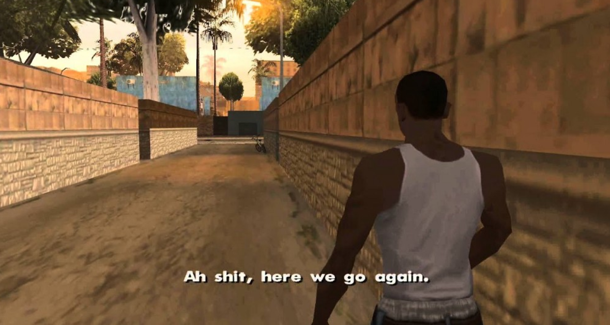

If you are reading this post, there is a very high chance that this is your first time in the world of videogames development.
<!--more-->

Probably you already have in mind your next videogame: you'll become a genius in this field. You're so thrilled!

You have already defined all the game mechanics. There is a little bit of GTA, there is a little bit of Fortnite, there is a little bit of WoW, there will be blackjack and hookers... In short: there is the best of every genre! But it's also open world: what's better than being able to also explore a vast game world, while you can do whatever you want? You already see the headlines in the specialized media, the players who recognize you on the street, the money that will rain...

You've probably also built a team, maybe with friends.

But then you probably exposed your amazing and revolutionary idea to someone who - with your surprise - doesn't seem to have the same enthusiasm for your project. It is evident that they do not understand, do not appreciate it. And now they have probably adviced about reading this post. What a jerk!

But now take a deep breath. We are about to start a journey.

#### A VIDEOGAME IS A PRODUCT

We have all been there. Some sooner, some later: we all had the __*dream phase*__. When you are still naive, when you do not yet know the world you are about to dive in, when everything still appears full of pink unicorns, rivers of chocolate and cotton candy trees... When __*video games are still video games*__.

But here's the revelation: a videogame remain a videogame only if you remain a simple gamer. Starting from the moment you decide to create one (then going from being a __*consumer*__ to being a __*producer*__), the videogame becomes something more: it becomes a __*product*__.

Yeah, I know: it's crazy. I'll give you a minute. Breathe deeply, like a good guy. Let's pick up now.

A product must have a market, it must be __*marketable*__. To make it so, several factors come into play.

##### A videogame needs the audience

A product that has no interested audience is a __*fail*__, even if it is the best videogame ever produced on this arm of the Milky Way.

The equation is very simple: it has no audience? Then nobody buys it. So you will never have any earning.

Another useful information: the public is not just composed by potentially interested players, as you may think. The audience can also be an __*investor*__, a __*publisher*__. In short: someone who believes in what you are doing and wants __*to invest*__ money on it.

##### A videogame needs to make money

It seems obvious, but let's say it anyway: having an audience is not enough to make a product successful. It needs to have a __*monetization strategy*__.

I know that you are not aiming for vile money and that yours is a vocation, a passion. That people who make videogames for money don't really love them. But I can assure you that the supermarket will not accept your passion when you have to pay for your sliced bread.

Whether it's a normal sale (example: $ 20 per copy) or an internal store full of IAPs, it doesn't matter. The important thing is to plan a __*sustainable strategy*__ that can repay you for the resources spent during the development of the product. This allows you to invest on the next one.

##### A videogame needs its place

A new product makes sense to exist if it fills a gap in the market or improves something that already exists. It must - therefore - go to __*solve a problem*__ in that niche of the market.

Making a copy of some other product doesn't make much sense. Why should someone choose your product that is identical to another that is already on the market (and that perhaps is already tested and well known)?

What would you choose to buy between Fortnite and a 1:1 copy of it? You got the point.

##### A videogame needs to be achievable

Even if a product has its audience, has its niche and has its own monetization strategy, it must then arrive on the market in humanly acceptable times, while spending resources that you can afford. This involves just one thing: you need __*to plan*__ the development. When do you start? When is it finished? What technologies do you need? Are you able to use them? Do you have the manpower to do it? What are the intermediate steps and on what dates do you expect to have stuff done? How much does each step cost you? Etc.

There is no need to be accurate to the millisecond. Planning a 12-months development and then spending 14 months is not as bad as planning a 6-months development and then spending 51 years. You must - therefore - be __*effective*__.

To plan effectively, you will need to know __*in detail*__ the product you are going to build and __*ask*__ your team to estimate times and costs. No needs to say that the more experience you have, the greater the accuracy of your estimation.

If publishing your product is scheduled for 2465 and the cost is equal to the Italian public debt, you can understand by yourself that there is a problem.

#### IDEAS ARE NOT ENOUGH

I didn't want to break your dreams, but I'm sorry to inform you that all those wonderful ideas that you explore daily inside your head are __*not enough*__ to make a working and successful product.

Warning: I did not say that they are useless. __*They are just not enough*__.

The __*idea-man*__ is not a professional figure. You can't even find it in any job advertisement, I'm sorry. Nor can you pretend to be _"the one with the ideas"_ in your team.

You need __*to study*__, __*to dedicate*__ yourself, __*to invest*__ your time on it and __*to work*__ on it. You need to develop practical and real skills that can be useful to your team. Do you like the idea of programming? Learn to do it. You are an artist? Do your artistic business. But you don't learn all of this overnight: it takes months and years of study and practice. __*Accept it*__. You __*cannot*__ build a videogame with hopes and ideals: you have to respect the profession as you do with any other.

*PS: If you really like to explore ideas, understand how they behave within the gameplay and create new mechanics, maybe what is right for you is the figure of the __game designer__. And this requires study and dedication too. Accept it.*

#### DO NOT BE ARROGANT

You will most likely have to deal with other colleagues, like the one who directed you to this post. Be smart: don't be __*arrogant*__. Don't be a jerk.

Arrogance is the enemy of learning. Accept that you don't know everything and that you can just learn from other professionals. Be polite and constructive. Nobody will want to help you if they have to bang their heads across a wall.

Try to understand every advice that they tell you, every sentence, every word. Particularly if you asked the original question. You can easily discard something completely stupid, but something that may initially seem unmotivated and meaningless may prove to be valuable in the future. You will rejoice that someone has spent 10 minutes of their life __*to help you*__.

Then you are free to continue making mistakes as you please, but at least you will do it __*consciously*__.

#### BE REALISTIC

I know, I know: your project is special, it's different from others, your team is capable, your idea is worth millions of dollars. And the community just tried to turn off your enthusiasm because they envy your idea and none of them have ever been as successful as you are about to be.

Clear. Smooth. But it just does not work like that.

##### Nobody wants to steal your idea

Think for a moment: why would a professional be interested in destroying your project? What's the point?

I already hear you saying: *"They will definitely want to steal my idea because they saw its potential!"*. No. Wrong.

We all have our own __*awesome idea*__. We all think it is incredibly valid and that we would like to realize it if only there was a chance. I have one too. Do you think that a professional does not have it and does search the web to steal a novice's idea?

The answer is clearly no. So what could be the motivation?

Simply, a professional has something you haven't yet: __*experience*__. They've already seen many projects start with the same premises and have already seen at least the 99% failing.

They already know everything I described in this article. And they know how to perform a __*reality check*__. They performed a reality check on their idea too, and they had to discard it precisely because - although they were in love with it - it hadn't all the requirements.

So they are saving you from spending years on something that will have no market or that is not achievable. A nice *"thank you"* doesn't sound too bad at this point, don't you think?

*P.S: clearly I am talking about projects that aim to be commercialized. If you're spending time on a project that targets learning, you can confidently pursue any goal you want. But even here I advise you not to overdo it. Something too big will end up being set aside as soon as boredom sets in. Try to choose projects that you are able to complete.*

##### Nobody gives you anything

And now the evergreen: *"I'm looking for collaborators, we'll share what the game will earn once it's on the market"*. Push this sentence down in the __*reality-machine*__.

While there is nothing wrong with that, this formula often leads straight to disaster if not managed correctly.

Why? Because no professional will give you their time and knowledge without any guarantee and without any salary. This is their job, they live of it. So the only people you will attract will be beginners and wannabes like you. How many chances does a group of disorganized and inexperienced wannabes have of being able to bring to the market a worthy game?

Guess how many. Very very few. The only good thing you will get out of this is: learning something.

It's the reality, even if you don't like it and you can't admit it.

If you plan to have some employees, you have to __*pay them*__. Estimate these costs before you start looking for them. You will certainly make a better first impression.

##### Credibility must be earned

You can't expect people to trust you just because you said so. You haven't proved anything yet. And until you do, you'll have the same credibility of a monkey typing on a typewriter, hoping to write the next best seller.

Remember that facts prove more than words. Show that you can do what you say, start doing it.

Spend your time on your project. Study to make it happen. Bring it on. Produce material to show around. That's the only way to get a minimum of consideration.

#### SO WHAT TO DO?

Yes, I can hear you: *"You're just talking about what I must not do. So what should I do?"*.

There is no right way to do things. There is no __*magic*__, sorry. I know, you are even more confused at the moment. What I can tell is that there are many methods that try to minimize the impact of the failure.

Yes: accept the fact that you will fail. Accept that your first products will be photonic crap. Ours were too (and maybe they continue and will continue to be).

The only really good strategy is being able to learn from your failures and to not drown in them. Failure, therefore, becomes part of the success.

A good way to approach the making of a product like a videogame (spoiler: that's just what I do) can be the following:

- Define the initial idea. I assume you are alone, this is your first time. So just don't overdo it. Try a simple idea, keep being realistic.
- Identify the core mechanics of your gameplay, your whole game works because of them.
- Write down this idea and these mechanics in a document. Often called GDD (Game Design Document), it will contain the detailed description of at least the key aspects of your game.
- Do a reality check: can this idea work? Do the game mechanics sound fun? Who's the audience? What problem do i solve? etc.
- If the answer is negative: try to change something. If it's still not fun, it's time to let it go. Don't get attached to it. Not every idea has to be realized. You can invest your time on other ideas that may work better. Back to the first point.
- If the answer is positive, it's time to create an MVP. A Minimum Viable Product. A barebone version of your game, without glitters. The essence of your game, the key mechanics.
- Play your MVP, get some people to play it. If it works and is fun even like thath, this is a good hint that you may have building something that people like.
- Keep going with your game and try to get to a slightly more advanced version, keep making people play it and collect feedback. Change the things that are wrong, enhance the things that are fun.
- Repeat until the product is ready for the market.

Once your first videogame is out, you can dedicate yourself to maintaining it and think about the next one. This process can be repeated several times, always raising the bar a little bit, until you are able to get the necessary strength to create the beautiful project you had in mind at the very beginning.

At this point you will discard it, thinking back to this post and how right we were.

#### IT'S TIME TO SAY GOODBYE

If you have come this far without having closed the post in anger: my compliments and forgive me! I didn't want to disrespect you, mock your passion or your dream. 

I wanted to piss you off on purpose to give you a further lesson: when we expose our idea to other people, we are exposing it to the world. And the world isn't friendly. I'm trying to tell you that it is very important to be able to extrapolate useful advices and information even from an intervention that at first sight seems hostile or unfair. Getting defensive to protect your draft from any possible criticism without even thinking about it does not make the criticism less true and the project more valid.

It's another step in building the foundations for a possible success!

I wish you the best of luck.

You will need it.

Welcome to game dev.